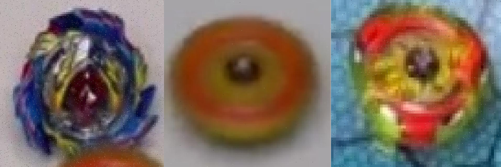
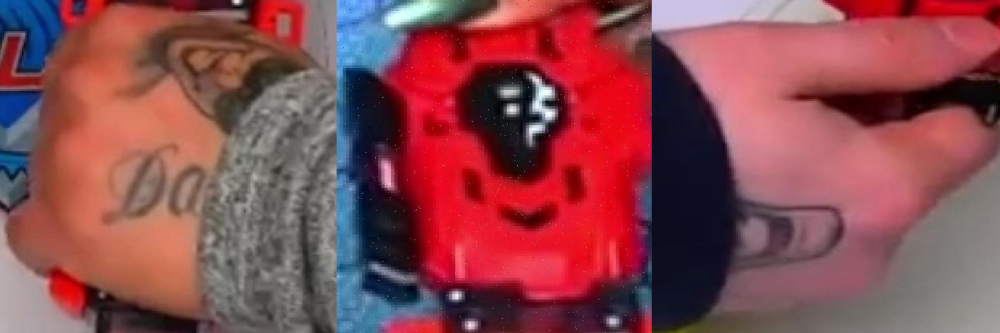
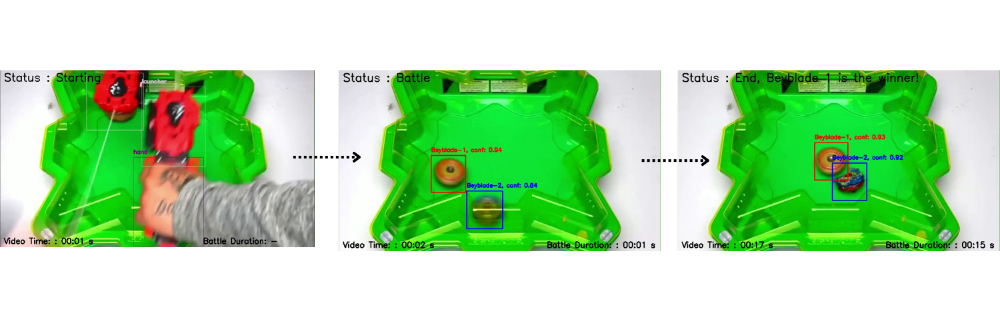
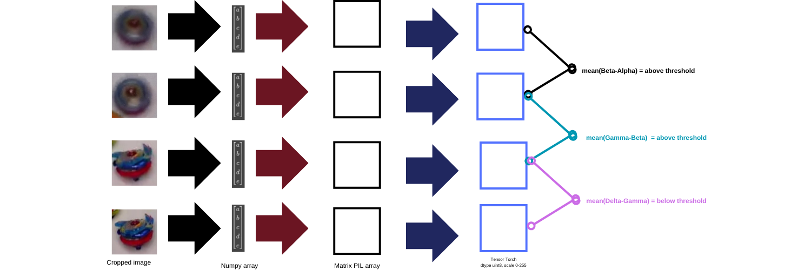
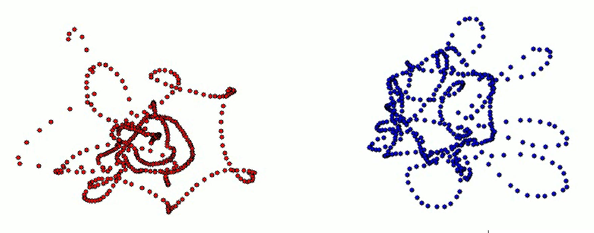

# Beyblade Battle Tracking with YOLOv8 Nano
## About
This project focuses on detecting and tracking two beyblades in a battle using YOLOv8 Nano. The goal is to determine which beyblade stops first, marking it as the loser. The system tracks both beyblades, analyzes their movements, and displays results in real time.

Input and output video access : https://drive.google.com/drive/folders/1O6KV6Sj-dFspW5lh1RYcefnLMRYfBE2c?usp=sharing
## Datasets
The datasets sourced from [Super Beyblade Family's Youtube video](https://www.youtube.com/watch?v=CIfr5618vy4&t=224s) and extracted by manual labelling from [Roboflow Universe](https://universe.roboflow.com/personalihsanworkspace/beyblade-battle-piifc/dataset/2). The datasets is divided into 1080 'train' images (92%) and 90 'valid' images (8%). It has applied preprocessing steps, including Auto-Orient, Resize Stretch to 640x640, an output of 3 training examples, and noise up to 1.21% of pixels to o improve the model’s robustness. The class labels consist of three categories: '0' for beyblade, '1' for hand, and '2' for beyblade launcher in object detection roboflow project.



## Training
### Model Architecture Layers
The model used is based on the YOLOv8 Nano (yolov8n.pt) architecture since it is designed to use for lightweighting detection needs. This architecture consists of 225 layers by: 3,011,433 parameters, 3,011,417 gradients, and 8.2 GFLOPs. The model fused by 168 layers, 3,006,233 parameters, 0 gradients, and 8.1 GFLOPs.

### Training Evaluation
* The model was trained by 150 epochs and in image size 640 pixels and train in Google Colab using Ultralytics (PyTorch) framework
* Utilizing GPU T4, the training completed in 1.285 hours
* For the overall performance, this model achieved; instances: 189, precision: 0.993, recall: 1.0, mAP@50: 0.995, and mAP@50-95: 0.783
* For the beyblade class performance '0', this model achieved; instances: 165, precision: 0.999, recall: 1.0, mAP@50: 0.995, and mAP@50-95: 0.843
* For the hand class performance '1', this model achieved; instances: 12, precision: 0.983, recall: 1.0, mAP@50: 0.995, and mAP@50-95: 0.806
* For the launcher class performance '2', this model achieved; instances: 12, precision: 0.998, recall: 1.0, mAP@50: 0.995, and mAP@50-95: 0.7

### Run Training Scripts
You may run the training in notebook python:
```
- ./beyblade-battle-tracking/yolo_beyblade_trainingroboflow.ipynb
```
This code are conceived by [Roboflow Blog's template](https://colab.research.google.com/github/roboflow-ai/notebooks/blob/main/notebooks/train-yolov8-object-detection-on-custom-dataset.ipynb#scrollTo=CjpPg4mGKc1v) for YOLOv8 custom object detection. The result will be saved in **./runs/detect/weights/best.pt**.

## Setup Configuration
1. Clone this repository
```
git clone https://github.com/ihsanabdulhakim/beyblade-battle-tracking.git
```
2. Install the required dependencies:
```
pip install -r -requirements.txt
```
  The python program requires the following libraries:
  * ultralytics
  * opencv-python
  * torch
  * torchvision
  * Pillow
  * numpy
  * pandas
  * sqlite3
  * time

3. Ensure the following required files exist:
```
- ./beyblade-battle-tracking/main.py
- ./beyblade-battle-tracking/model/best.pt
- ./beyblade-battle-tracking/input/input.mp4 # You may change the input video name in the folder and in python scripts
```
4. Run the main script:
```
python main.py
```
**Note:** This project is compatible with Python 3.9 version.

5. The results will be saved into this address:
```
- ./beyblade-battle-tracking/output
```
Make sure your terminal supports displaying GUI.

## Beyblade Battle Tracking Algorithm
The idea of this base program was convolutional neural network for object detection and YOLO object tracking system. The program will read the input file and initialized the necessary variables as 0 (None) or 'False' statements.  
The usage of the model comes from implementation of **model.track()** function sourced from [Ultralytics YOLO Docs](https://docs.ultralytics.com/modes/track/).
<p align="center">
  
  <br>
  YOLOv8 People Tracking Algorithm (sourced by Ultralytics)
</p>

### Display Encounter
Once the video successfully being read, the program will identify the labels by saved id in the model along with the display status and time counter for video duration playtime each seconds. The program works by step of:
* **If no object detected by the known stored labels then "Status: //None\\"**
* **If object detected due to stoded labels then the bounding box of each objects will appear and the display become "Status: Starting"**
* **If the object that being detected is beyblade, then the display text will including the unique id numbers and confidence each frame**
* **{The status will be change to "Status: Battle" immediately after the second beyblades is detected. In this time, the battle duration will begin time counting each seconds**
* **The status will be change to "Status: End, Beyblade //id\\ is the winner!" after the winning statement being enabled**

## Winning Parameter
The criterion for determining the winner in a Beyblade battle is based on the duration of the beyblade's spin. Therefore, the parameter used in this algorithm is identifying the beyblade that stops spinning first, which is declared as the losing beyblade. Here i used two steps approaches:

❐ Euclidean Distance
<p align="center">
  
  <br>
  Euclidean distance in 2D (sourced by Wikipedia)
</p>
This method is to calculate distance (difference) between two points for two dimension. To achieve this, it is important to understand that object detection identifies objects within a bounding box format: x1, y1, x2, y2. Therefore, we can approximate the current positions of the beyblades using the midpoint calculation as follows:

<p align="center">
  
  <br>
</p>

This x_c and y_c will be defined as **beyblade_pos**, After that, we assign this value to be the **beyblade_pos_before**, initially set to None. **beyblade_pos_before** will be used as a factor to subtract from the current center coordinates (**beyblade_pos**) of the beyblade obtained in the new frame by euclide distance calculation. The difference distance name as **beyblade_pos_diff** is the parameter whether the remain beyblades is slightly change position or not by the boundary of threshold value **1.0**. Whoever reach out the difference value under this threshold will be assuming as **Not changing position**.

❐ Image Array Substraction

Another approaches that will define the winning benchmarks is by the face of the object. Since the image of beyblades during spin and stop is very different, we can use this strategies to reach our main goal for getting the losing beyblades.


First, we extract numpy array of image crop sized bounding box. This will end up changing image to be mathematical matrix. For safest reason, we need to store the matrix value to remain same size shape for every frame. Here, I convert the matrices to be tensor torch 8 bit (uint8). Similar to the euclidean techniques, we saved the recent tensor value as **beyblade_array_this_fps** to **beyblade_array_this_fps_before** which will be used in the future frame calculation of **mean_diff_beyblade**. 
The estimation of this procedures is that the substraction which is nearest to 0 can be stated to be **same appearances for each frame**. But this will cause trouble if the similarity occur by coincidence. To solve that problem, I created implementation that atleast there are 3 times that the absolute difference value of **mean_diff_beyblade** is under threshold **0.20** (to yield the nearest zero value as possible). 
In order to realize this, I introduce **winner_counter** variables, the more a beyblades fulfill the lose condition, the more for **winner_counter** to getting addition of the points. This points will be sent to acquire the enemy of the lose beyblade, which makes the other beyblades that receive more points will become the winner.

So I combining these approaches and this is the step to getting the winner of beyblades battle:
1. Calculating euclidean distance between each beyblades center position
2. If the euclidean distance < 1.00, calculate the absolute mean of beyblades tensor.
3. For the value < 0.20 that appears sequential then the enemy point will be added untill 3 and that makes the other beyblades become the champion
## Beyblades Tracking
The beyblades tracking is an additional function to gain the visualization process of beyblades spin during the battle. I save every center beyblades coordinates (x_c and y_c) of each frame after the battle begin in array variables **track_history**. Then this value will show the coordinates for every frame build with white background. The result is establish in this address:
```
- ./output/beyblade1-tracking-trails.mp4
- ./output/beyblade2-tracking-trails.mp4
```

## Collision Count
Collisions between the beyblades are detected by calculating the overlap between their bounding boxes. If the overlap ratio exceeds a defined threshold, it is counted as a collision. The number of collisions is tracked throughout the battle. To achieve this, we extracted the beyblade bounding box coordinates; x1, y1, x2, y2. 


This calculation determines the width of the overlap along the x-axis. If the result is negative, it indicates no overlap (thats why only 0 value to received there is no collision). Likewise for overlap along the y-axis is inidcator of collision of heights. The ratio overlap as approach 100% or 1 means that the overlap_area is as same as the area of bounding box (which is impossible since the together encouter just creating collision) so I pick threshold value **0.03** or 3% of **overlap_ratio** considered to collide.

## Database Analysis
The program also provide the creating data storage of CSV and .db. There are 2 tables that created during running the program:
1. beyblade-tracking-analyzed.csv
   In this dataframe, the program save the real-time captured data during the battle of beyblades (happening after the second beyblades being detected by the model detection). It saves 14 data field (columns) which include the first five is beyblade 1 properties, the second five is beyblade 2 properties, timeframe, timestamps, status_collision, and collision_count.
   The timeframe itself is the timefreeze of each saved detected beyblade frame which take in full duration of the video (For example; the battle start on 7 seconds after the video begin, then the timestamps will be record from 07 seconds). Meanwhile timestamps is the duration of timefreeze beyblade detected on the time after the battle begin. The data integration work simultaneously until the winning condition or breaking loop condition.
2. beyblade_battle_result.csv
   In this dataframe, only 1 record will be conceived. It will stored after the winning condition is occured. The field of this dataframe are 4 fields; 'Beyblade ID that win', 'Beyblade ID that lose', 'Duration battle', 'Collision count'.
   After both of dataframes is created, the program will create database (.db) using SQLite scripts with filenames 'beybladebattletracking.db'.

## Handling Problems
Since the model achieved a precision below 0.90 for class '0' (Beyblades), there are instances where beyblade detection may temporarily disappear. To address this issue, I developed an algorithm that stores the last known position of a beyblade in track_history whenever the detection is temporarily lost (due to occlusions or false positives).
Additionally, I implemented a logic to handle cases where only one beyblade is detected after the other has faded away. Once the missing beyblade is detected again, it will be assigned to its previous ID. For example, if **only beyblade2 is visible** in the frame, **the next newly detected beyblade** will be assigned to **beyblade1**, also applies to reverse condition.
